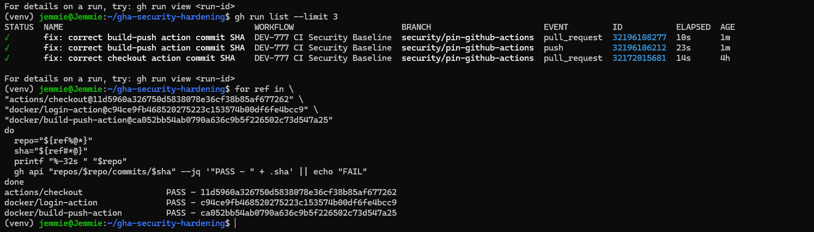
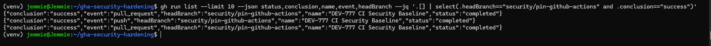
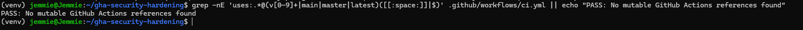
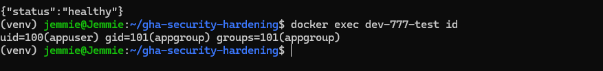
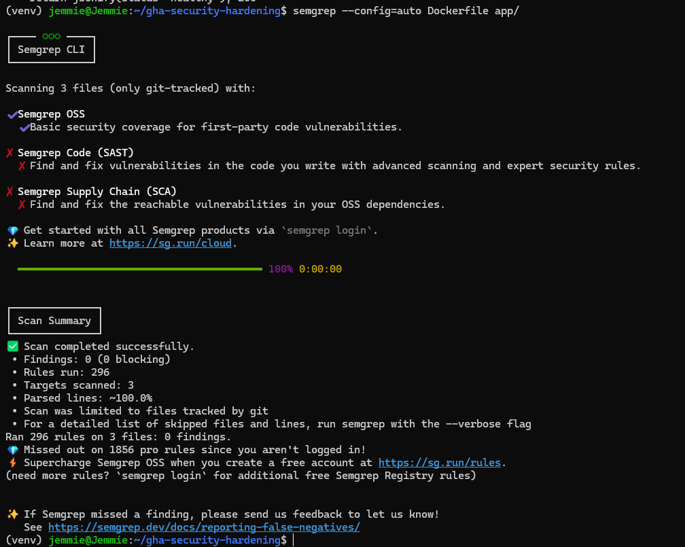

# GitHub Actions Security Hardening

## Overview

Security remediation project focused on eliminating mutable GitHub Actions references and strengthening CI/CD, container, and application security.

## Security Finding

The workflow used mutable GitHub Actions tags:

```text
actions/checkout@v4
docker/login-action@v3
docker/build-push-action@v5
```

Mutable tags introduce supply-chain risk because the underlying commit can change without modifying the workflow.

## Remediation

- Pinned GitHub Actions to verified 40-character commit SHAs.
- Applied least-privilege workflow permissions.
- Added recurrence validation for mutable action references.
- Hardened the Docker container with non-root execution.
- Replaced the Flask development server with Gunicorn.
- Added HTTP security headers.
- Performed static and dynamic security validation.

## Validation Results

| Control | Result |
|---|---|
| Immutable SHA pinning | PASS |
| Mutable-reference recurrence check | PASS |
| CI/CD regression | PASS |
| Docker build | PASS |
| Non-root container runtime | PASS |
| Application health check | HTTP 200 |
| Semgrep | 0 findings |
| OWASP ZAP | 65 PASS / 0 FAIL |
| Pull Request | Merged |
| Final workflow on `main` | PASS |

## Evidence

### 1. Immutable SHA Validation

Verified that GitHub Actions dependencies are pinned to immutable commit SHAs.



### 2. CI/CD Regression Validation

Confirmed the workflow continued to execute successfully after remediation.



### 3. Mutable Reference Validation

Confirmed no mutable GitHub Actions references remained.



### 4. Container Runtime Hardening

Verified that the application container executes as a non-root user.



### 5. Static Security Analysis

Semgrep completed with zero findings.



## OWASP ZAP Baseline

Dynamic application security testing completed with:

```text
PASS: 65
WARN-NEW: 2
FAIL-NEW: 0
FAIL-INPROG: 0
```

Full scan output: [`zap-report.html`](zap-report.html)

## Additional Evidence

Supporting validation artifacts are available in [`evidence/`](evidence/):

- `01-pre-remediation-validation.txt`
- `02-action-sha-resolution.txt`
- `02-post-remediation-validation.txt`

## Outcome

The remediation combines immutable action pinning, least-privilege permissions, recurrence controls, container hardening, static analysis, dynamic security testing, and CI/CD regression validation.

**Final status: PASS**